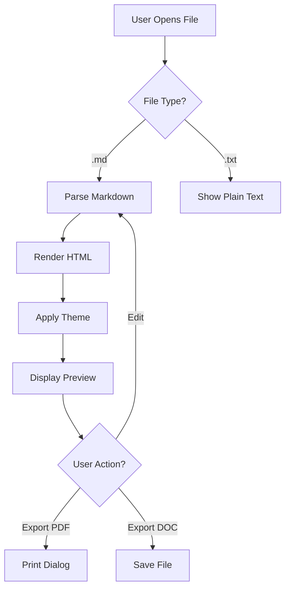
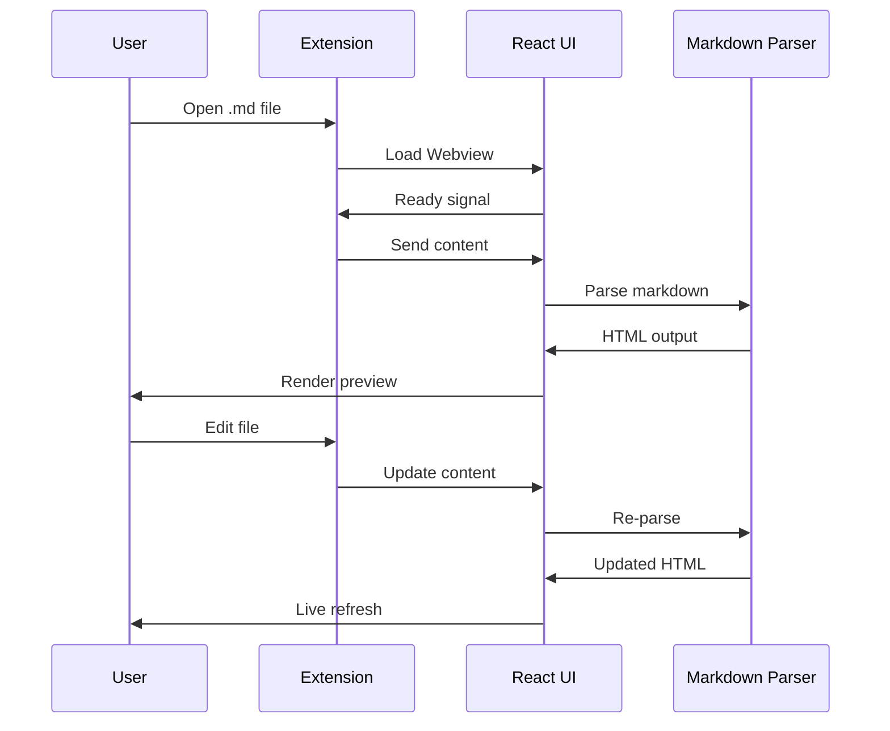
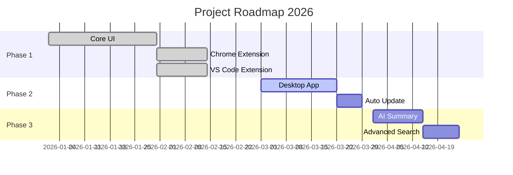
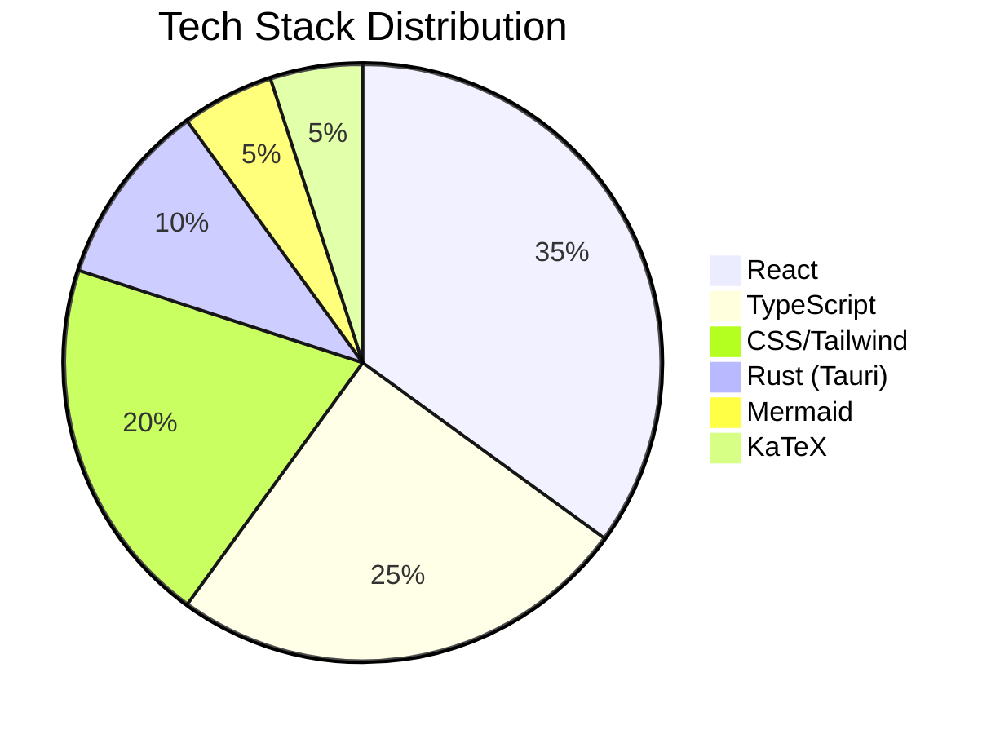

# Markdown Viewer Premium — Feature Showcase 💎

> The most beautiful Markdown previewer — available for Chrome, VS Code, and Desktop.

## Table of Contents

- [Typography](#typography)
- [Code Blocks](#code-blocks)
- [Mermaid Diagrams](#mermaid-diagrams)
- [Math & LaTeX](#math--latex)
- [GitHub Alerts](#github-alerts)
- [Tables](#tables)
- [Task Lists](#task-lists)
- [Images & Media](#images--media)
- [Blockquotes](#blockquotes)

---

## Typography

### Headings

# Heading 1
## Heading 2
### Heading 3
#### Heading 4

### Text Formatting

This is **bold text**, this is *italic text*, and this is ~~strikethrough~~.

You can also use `inline code` within a sentence.

Here is a [link to the website](https://markdown-viewer-premium-site.vercel.app) and an auto-linked URL: https://github.com

---

## Code Blocks

### JavaScript

```javascript
// Fibonacci with memoization
const fibonacci = (n, memo = {}) => {
  if (n in memo) return memo[n];
  if (n <= 1) return n;
  memo[n] = fibonacci(n - 1, memo) + fibonacci(n - 2, memo);
  return memo[n];
};

console.log(fibonacci(50)); // 12586269025
```

### Python

```python
from dataclasses import dataclass
from typing import Optional

@dataclass
class TreeNode:
    val: int
    left: Optional["TreeNode"] = None
    right: Optional["TreeNode"] = None

def inorder(root: Optional[TreeNode]) -> list[int]:
    if not root:
        return []
    return inorder(root.left) + [root.val] + inorder(root.right)
```

### Go

```go
package main

import "fmt"

func quickSort(arr []int) []int {
    if len(arr) <= 1 {
        return arr
    }
    pivot := arr[0]
    var left, right []int
    for _, v := range arr[1:] {
        if v <= pivot {
            left = append(left, v)
        } else {
            right = append(right, v)
        }
    }
    result := quickSort(left)
    result = append(result, pivot)
    result = append(result, quickSort(right)...)
    return result
}

func main() {
    fmt.Println(quickSort([]int{3, 6, 8, 10, 1, 2, 1}))
}
```

### SQL

```sql
SELECT
    u.name,
    COUNT(o.id) AS total_orders,
    SUM(o.amount) AS total_spent
FROM users u
LEFT JOIN orders o ON u.id = o.user_id
WHERE o.created_at >= '2026-01-01'
GROUP BY u.name
HAVING total_spent > 1000
ORDER BY total_spent DESC
LIMIT 10;
```

---

## Mermaid Diagrams

### Flowchart



### Sequence Diagram



### Gantt Chart



### Pie Chart



---

## Math & LaTeX

Einstein's equation: $E = mc^2$ and the quadratic formula: $x = \frac{-b \pm \sqrt{b^2 - 4ac}}{2a}$

$$
\int_{-\infty}^{\infty} e^{-x^2} dx = \sqrt{\pi}
$$

$$
\begin{bmatrix} 1 & 2 \\ 3 & 4 \end{bmatrix} \times \begin{bmatrix} a \\ b \end{bmatrix} = \begin{bmatrix} a + 2b \\ 3a + 4b \end{bmatrix}
$$

---

## GitHub Alerts

> [!NOTE]
> This is a note — useful for additional information the reader should be aware of.

> [!TIP]
> This is a tip — helpful advice for doing things better or more easily.

> [!IMPORTANT]
> This is important — key information users need to know to achieve their goal.

> [!WARNING]
> This is a warning — urgent info that needs immediate attention to avoid problems.

> [!CAUTION]
> This is a caution — advises about risks or negative outcomes of certain actions.

---

## Tables

| Feature | Chrome | VS Code | Desktop |
|---------|:------:|:-------:|:-------:|
| Markdown Rendering | ✅ | ✅ | ✅ |
| Mermaid Diagrams | ✅ | ✅ | ✅ |
| Math / LaTeX | ✅ | ✅ | ✅ |
| Syntax Highlighting | ✅ | ✅ | ✅ |
| Dark / Light Theme | ✅ | ✅ | ✅ |
| PDF Export | ✅ | ✅ | ✅ |
| DOC Export | ✅ | ✅ | ✅ |
| Live Sync | — | ✅ | — |
| Drag & Drop | — | — | ✅ |
| Auto Update | — | — | ✅ |

---

## Task Lists

- [x] GitHub Flavored Markdown
- [x] Mermaid diagram support
- [x] KaTeX math rendering
- [x] Syntax highlighting (100+ languages)
- [x] Dark / Light theme toggle
- [x] Table of Contents with active tracking
- [x] Image lightbox with zoom & pan
- [x] PDF & DOC export
- [ ] AI-powered document summary
- [ ] Presentation mode
- [ ] Advanced search with regex

---

## Blockquotes

> "Any fool can write code that a computer can understand.
> Good programmers write code that humans can understand."
>
> — Martin Fowler

### Nested Blockquotes

> First level
>> Second level
>>> Third level

---

## Horizontal Rules

Three different styles:

---

***

___

---

## Lists

### Ordered List

1. Install the extension
2. Open a `.md` file
3. Press `Ctrl + Shift + V`
4. Enjoy the preview!

### Unordered List

- Beautiful glassmorphism UI
- Cross-platform support
  - Chrome / Edge / Brave
  - Visual Studio Code
  - Desktop (Windows, macOS, Linux)
- Open source

---

*Made with ❤️ by [Bumkom](https://github.com/chieund)*
